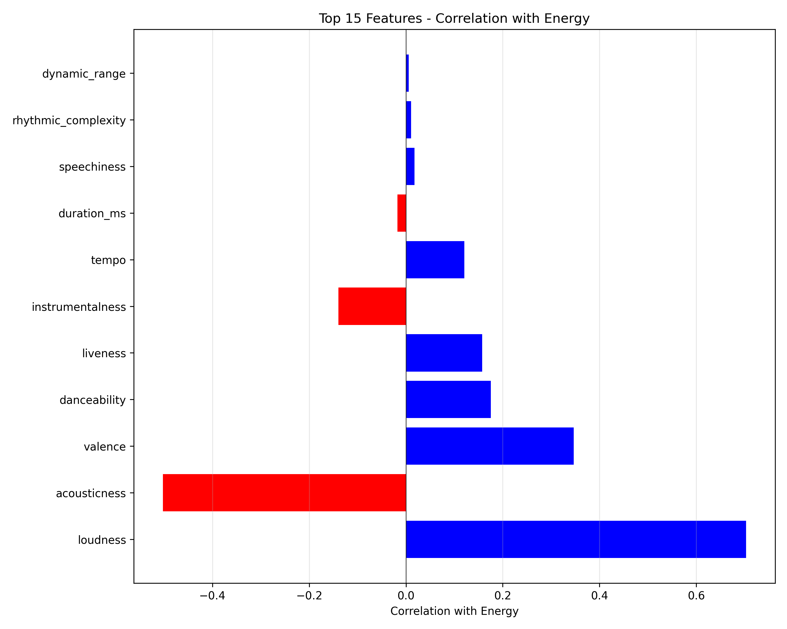
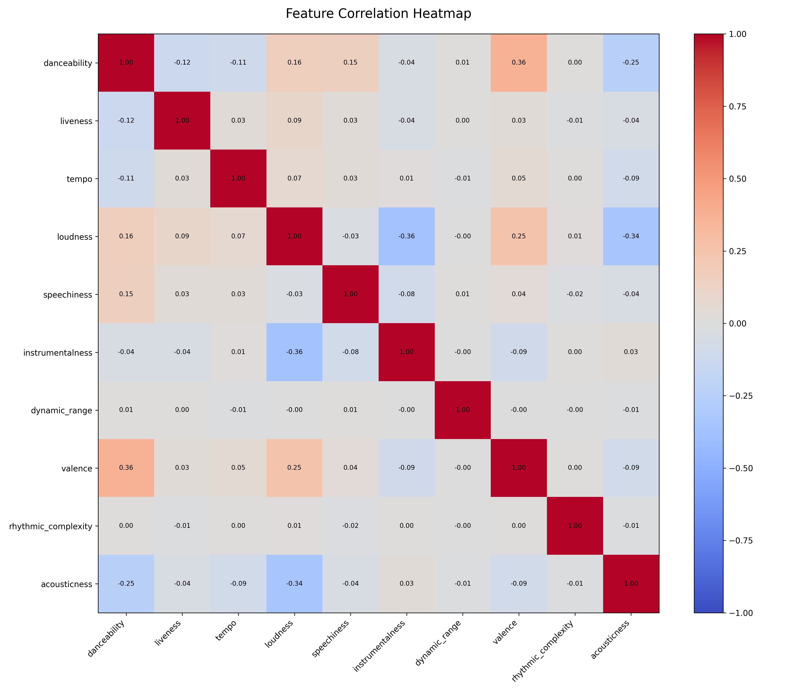
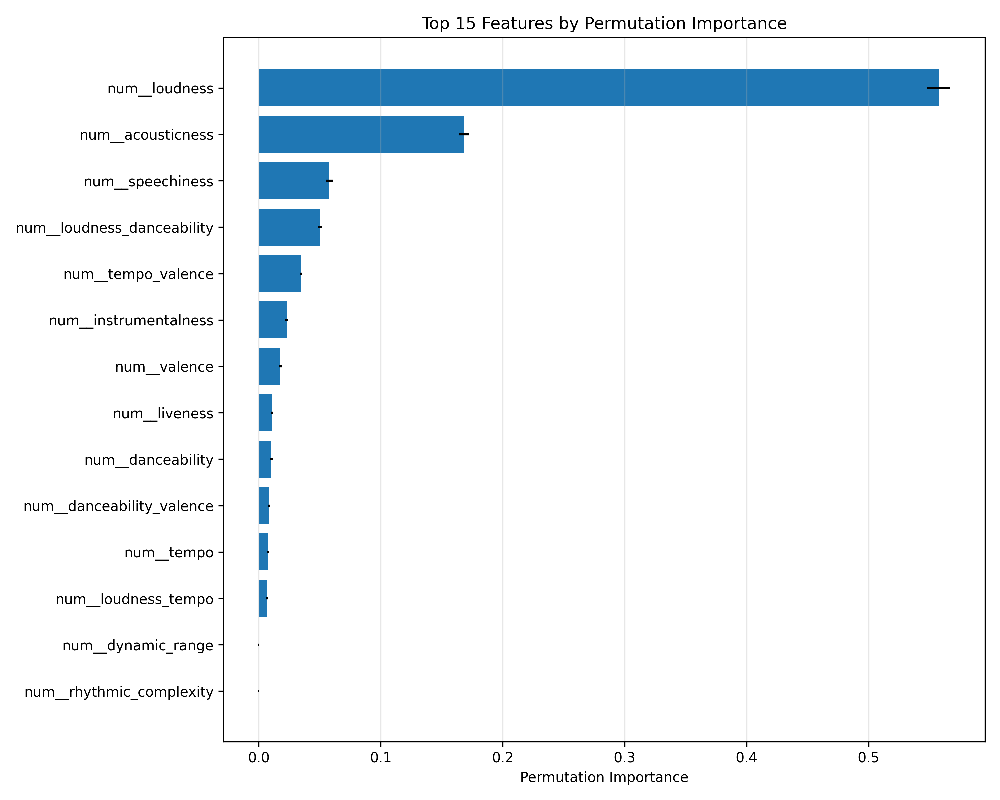
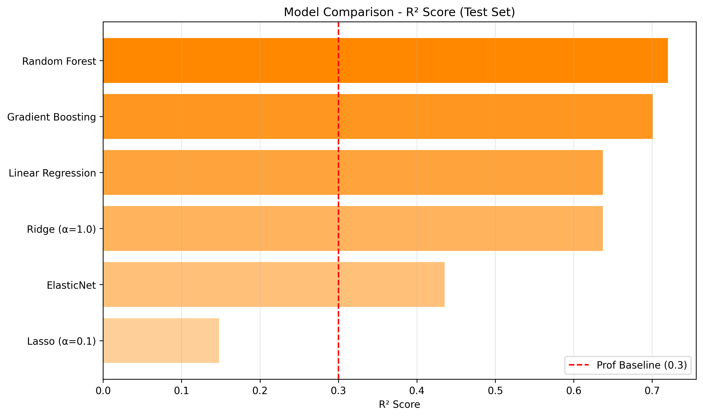

# 🎵 Spotify Energy Prediction  
## Predictive Analytics – Group Assignment  
**Authors:** Thomas Endrass · Johannes Lehner · Lukas Mayr

---

## 🎯 Project Overview

The objective of this project was to develop a **regression model to predict the energy of Spotify tracks** based on audio features.  
Energy ranges from **0.0 to 1.0** and describes how fast, loud, and intense a song feels.

A provided **baseline Linear Regression model** achieved an **R² of ~0.30**.  
Our goal was to **significantly outperform this baseline** using a **clean, reproducible, and methodologically sound machine-learning workflow**, aligned with the course content.

### Final Result

- **Model:** Random Forest Regressor  
- **Performance:** **R² = 0.78**  
- **Improvement over baseline:** **~2.5× higher explanatory power**

---

## 📊 Key Findings

### 1. Loudness Is the Dominant Driver of Energy

Exploratory analysis and permutation importance revealed that **loudness** is by far the most influential predictor of song energy.

- Loud tracks are almost always energetic  
- **Acousticness** shows a strong negative relationship with energy  
- Results align closely with the musical definition of energy  



📈 *See also:* `plots/permutation_importance.png`

---

### 2. Interaction Features Capture Perceptual Effects

As an initial proof of concept, we trained a simple model using only **loudness** and **acousticness**, which achieved an **R² of approximately 0.60** without hyperparameter tuning. To avoid relying exclusively on one or two dominant features, we tried to engineer additional features to capture combined perceptual effects.

The evaluated features were derived from correlation analysis during exploration and basic musical intuition:

 `loudness_tempo`  
 `danceability_valence`  
 `loudness_danceability`  
 `tempo_valence`  

- While **loudness** remained the dominant predictor, some interaction features appeared among the **Top-10**, which we saw as an encouraging result suggesting a limited but complementary contribution.

- Several early feature-engineering attempts resulted in unrealistically high R² values (up to ~0.98), which led us to identify **target leakage** sneaking repeatly in amidst the hustle. All retained interaction features were therefore engineered strictly on **X**.

| Correlation Heatmap | Permutation Importance |
|--------------------|------------------------|
|  |  |

---

### 3. Ensemble Models Outperform Linear Models

Six regression models were evaluated under identical conditions:

<p align="center">
<table>
<tr>
<td width="50%">

| Model | R² (Test) |
|---|---|
| **Random Forest** | **~0.78** |
| Gradient Boosting | ~0.70 |
| Linear Regression | ~0.64 |
| Ridge Regression | ~0.64 |
| ElasticNet | ~0.44 |
| Lasso | ~0.15 |
</td>
<td width="50%">

</td>
</tr>
</table>
</p>

Tree-based ensemble models clearly outperform linear approaches, confirming **non-linear relationships** between audio features and perceived energy.

---

## 🧠 Methodology

### Data Preparation
- Removed non-informative identifier columns  
- Retained numeric features only; categorical features were tested but ultimately excluded due to stability issues within the preprocessing pipeline  
- Train/Test split: **80 / 20**

### Feature Engineering & Leakage Control
- No usage of the target variable during preprocessing  
- No global statistics computed outside the training split  

### Feature Selection
- **Permutation Importance** used for feature ranking  
- Final model trained on the **Top-10 features** to balance performance and stability  

### Model Development
1. Baseline Linear Regression  
2. Systematic model comparison  
3. Feature ranking and selection  
4. Hyperparameter tuning using **GridSearchCV (5-fold CV)**  
5. Final training and evaluation  


---

## 📁 Project Structure

```
homework_spotify-algorithmus/
├── data/
│ └── spotify-tracks.csv
│
├── models/
│ ├── model.pkl
│ └── top_10_indices.pkl
│
├── plots/
│ ├── correlation_heatmap.png
│ ├── permutation_importance.png
│ └── model_comparison.png
│
├── exploration.ipynb
├── preprocessing.ipynb
├── modelling.ipynb
├── pipeline_gridsearch.ipynb
├── model_usage.ipynb
│
├── requirements.txt
│
└── README.md
```

---

## 📄 File Explanation

### Folders
- **data/** – raw dataset  
- **models/** – trained model and selected feature indices  
- **plots/** – all visual outputs used for analysis and reporting  

### Notebooks
- **exploration.ipynb** – exploratory data analysis (EDA), correlation analysis, and initial feature testing  
- **preprocessing.ipynb** – data cleaning, feature engineering, and construction of the preprocessing pipeline  
- **modelling.ipynb** – systematic model comparison across multiple regression algorithms  
- **pipeline_gridsearch.ipynb** – hyperparameter tuning, pipeline optimization, and final model selection  
- **model_usage.ipynb** – final model training and example inference workflow  


---

## 🛠️ Libraries Used

- Python 3.12  
- pandas, numpy  
- scikit-learn  
- matplotlib  
- pickle (preinstalled)  


---

## ⚠️ Disclaimer

Some minor code artifacts and unused components remain in the repository.  
These are partly the result of iterative experimentation during model development and partly due to the fact that **collaborative development via GitHub was a new learning experience for the team**. As the project progressed, the available time towards the end became limited, and the primary focus was placed on ensuring methodological correctness, reproducibility, and a clean final model rather than cosmetic code refactoring.

All core results, evaluations, and conclusions presented in this project are fully reproducible and unaffected by these artifacts.
